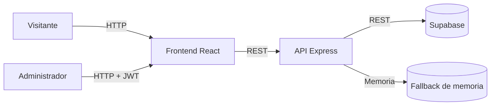
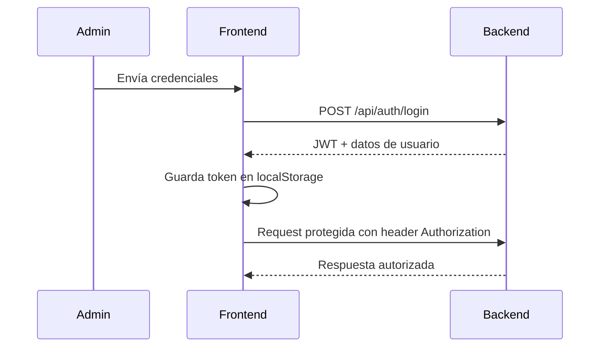
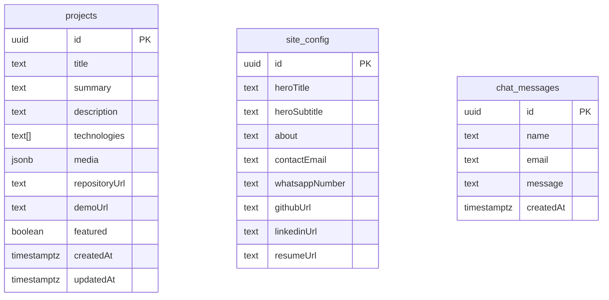

# AGX Portfolio – Plataforma Integral de Portafolio

Proyecto monorepo que reúne el frontend (React) y el backend (Node.js + Express) de un portafolio profesional orientado a mostrar proyectos de software y administrar el contenido desde un panel privado.

## 🚀 Objetivos

- Presentar información profesional, proyectos destacados y medios de contacto.
- Permitir la gestión de proyectos, configuración del sitio y mensajes de chat desde un panel seguro.
- Integrar autenticación basada en JWT y comunicación con Supabase (opcional) para persistencia.

## 🗂️ Estructura del repositorio

```text
/
├── backend/            # API REST Express
├── frontend/           # Aplicación React + Vite
└── README.md           # Este documento
```

### Backend

- Arquitectura por capas: rutas → controladores → servicios → utilidades.
- Integración opcional con Supabase mediante su API REST.
- Almacenamiento en memoria por defecto para facilitar pruebas locales.

### Frontend

- Vite + React con Tailwind CSS, Framer Motion y React Router.
- Context API para manejar el estado de autenticación.
- Vistas públicas y administrativas conectadas a la API.

## 🧱 Arquitectura General



## 🔐 Flujo de Autenticación



## 🧩 Casos de Uso Principales

```mermaid
usecaseDiagram
  actor Visitante
  actor Administrador
  Visitante -- (Consultar proyectos)
  Visitante -- (Enviar mensaje de chat)
  Visitante -- (Ver información del autor)
  Administrador -- (Iniciar sesión)
  Administrador -- (Gestionar proyectos)
  Administrador -- (Actualizar configuración)
  Administrador -- (Revisar mensajes)
```

## 🛠️ Configuración inicial

### 1. Backend

```bash
cd backend
cp .env.example .env
# Edita credenciales si es necesario
npm install
npm run dev
```

### 2. Frontend

```bash
cd frontend
cp .env.example .env
npm install
npm run dev
```

El frontend correrá en `http://localhost:5173` y el backend en `http://localhost:4000`.

> **Nota:** En este entorno de entrega no se ejecutaron `npm install` por restricciones de red, pero los `package.json` incluyen todas las dependencias necesarias.

## 🌐 Endpoints relevantes

| Método | Endpoint | Descripción |
| --- | --- | --- |
| POST | `/api/auth/login` | Inicia sesión y devuelve token JWT. |
| GET | `/api/projects` | Lista pública de proyectos. |
| POST | `/api/projects` | Crea proyecto (requiere token). |
| PUT | `/api/projects/:id` | Actualiza proyecto (requiere token). |
| DELETE | `/api/projects/:id` | Elimina proyecto (requiere token). |
| GET | `/api/config` | Recupera configuración pública. |
| PUT | `/api/config` | Actualiza configuración (requiere token). |
| GET | `/api/chat` | Mensajes recibidos (requiere token). |
| POST | `/api/chat` | Envía mensaje desde el sitio público. |

## 🗃️ Modelado de datos (Supabase sugerido)



## 📝 Documentación adicional

- `backend/README.md`: Detalles de la API y configuración.
- `frontend/README.md`: Guía de la app React.

## 📌 Roadmap sugerido

1. Persistir usuarios administradores en Supabase con contraseñas hasheadas.
2. Implementar pruebas automatizadas (unitarias y end-to-end).
3. Añadir despliegue automatizado (CI/CD) y monitoreo.
4. Integrar WebSockets/Supabase Realtime para chat en vivo.

---

¡Listo! Con esta base ya puedes iterar sobre nuevas funcionalidades, personalizar estilos y preparar el despliegue de tu portafolio profesional.
