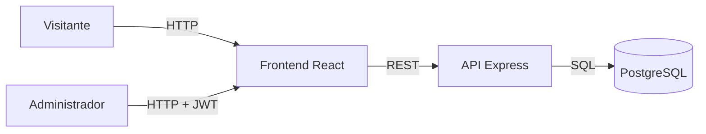
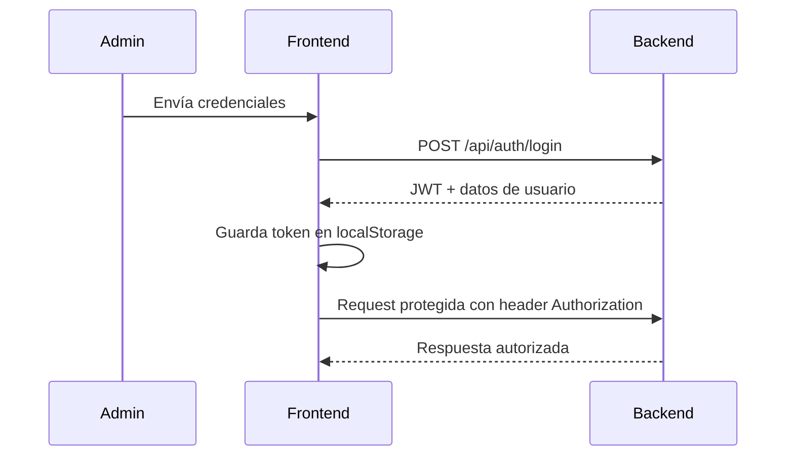

# AGX Portfolio – Plataforma Integral de Portafolio

Proyecto monorepo que reúne el frontend (React) y el backend (Node.js + Express) de un portafolio profesional orientado a mostrar proyectos de software y administrar el contenido desde un panel privado.

## 🚀 Objetivos

- Presentar información profesional, proyectos destacados y medios de contacto.
- Permitir la gestión de proyectos, configuración del sitio y mensajes de chat desde un panel seguro.
- Integrar autenticación basada en JWT y PostgreSQL para persistencia.

## 🗂️ Estructura del repositorio

```text
/
├── Backend2/           # API REST Express (PostgreSQL)
├── backend/            # API REST Express (Supabase - legacy)
├── frontend/           # Aplicación React + Vite
├── docker-compose.yml  # Orquestación Docker
└── README.md           # Este documento
```

## 🐳 Docker Deployment

### Servicios

| Servicio  | Puerto | Descripción           |
|-----------|--------|----------------------|
| PostgreSQL| 5432   | Base de datos        |
| Backend   | 4000   | API REST             |
| Frontend  | 5173   | Aplicación React     |

### Inicio Rápido

```bash
# Iniciar todos los servicios
docker-compose up -d

# Ver logs
docker-compose logs -f

# Detener servicios
docker-compose down
```

### Comandos Útiles

```bash
# Iniciar en foreground (ver logs)
docker-compose up

# Reconstruir imágenes
docker-compose build --no-cache

# Ver estado de servicios
docker-compose ps

# Acceder a terminal del backend
docker exec -it agxport-backend sh

# Acceder a PostgreSQL
docker exec -it agxport-postgres psql -U postgres -d agxport

# Ver logs de un servicio
docker-compose logs backend
docker-compose logs frontend
docker-compose logs postgres
```

## 🛠️ Configuración

### Variables de Entorno

#### PostgreSQL
- `POSTGRES_DB`: agxport
- `POSTGRES_USER`: postgres
- `POSTGRES_PASSWORD`: postgres

#### Backend
- `PORT`: 4000
- `JWT_SECRET`: your-secret-key-change-in-production
- `ADMIN_EMAIL`: admin@example.com
- `ADMIN_PASSWORD`: changeme123
- `PGHOST`: postgres
- `PGPORT`: 5432
- `PGDATABASE`: agxport

#### Frontend
- `VITE_API_URL`: http://localhost:4000/api

## 🧱 Arquitectura



## 🔐 Flujo de Autenticación



## 🧩 Casos de Uso

```mermaid
usecaseDiagram
  actor Visitante
  actor Administrador
  Visitante -- (Consultar proyectos)
  Visitante -- (Enviar mensaje de chat)
  Visitante -- (Ver información del autor)
  Administrador -- (Iniciar sesión)
  Administrador -- (Gestionar proyectos)
  Administrador -- (Actualizar configuración)
  Administrador -- (Revisar mensajes)
```

## 🌐 Endpoints

| Método | Endpoint | Descripción |
|--------|----------|-------------|
| POST | `/api/auth/login` | Inicia sesión y devuelve token JWT. |
| GET | `/api/projects` | Lista pública de proyectos. |
| POST | `/api/projects` | Crea proyecto (requiere token). |
| PUT | `/api/projects/:id` | Actualiza proyecto (requiere token). |
| DELETE | `/api/projects/:id` | Elimina proyecto (requiere token). |
| GET | `/api/config` | Recupera configuración pública. |
| PUT | `/api/config` | Actualiza configuración (requiere token). |
| GET | `/api/chat` | Mensajes recibidos (requiere token). |
| POST | `/api/chat` | Envía mensaje desde el sitio público. |

## 🗃️ Modelo de Datos (PostgreSQL)

```sql
-- projects
id UUID PRIMARY KEY,
title VARCHAR(255),
summary TEXT,
description TEXT,
technologies TEXT[],
repository_url VARCHAR(500),
demo_url VARCHAR(500),
media JSONB,
featured BOOLEAN,
created_at TIMESTAMP,
updated_at TIMESTAMP

-- site_config
id UUID PRIMARY KEY,
hero_title VARCHAR(255),
hero_subtitle TEXT,
about TEXT,
contact_email VARCHAR(255),
whatsapp_number VARCHAR(50),
github_url VARCHAR(500),
linkedin_url VARCHAR(500),
resume_url VARCHAR(500)

-- chat_messages
id UUID PRIMARY KEY,
name VARCHAR(255),
email VARCHAR(255),
message TEXT,
created_at TIMESTAMP
```

## 📝 Desarrollo Local (sin Docker)

### Backend
```bash
cd Backend2
cp .env.example .env
npm install
npm run db:init
npm run dev
```

### Frontend
```bash
cd frontend
cp .env.example .env
npm install
npm run dev
```

---

¡Listo! Con esta base ya puedes iterar sobre nuevas funcionalidades, personalizar estilos y preparar el despliegue de tu portafolio profesional.
